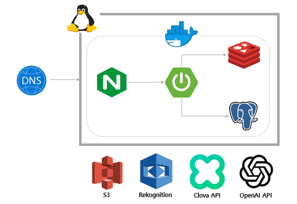

- [발표자료](https://seungsuhwang-portfolio.s3.ap-northeast-2.amazonaws.com/artfolio_%EB%B0%9C%ED%91%9C%EC%9E%90%EB%A3%8C.pdf)
- [시연영상](https://seungsuhwang-portfolio.s3.ap-northeast-2.amazonaws.com/KakaoTalk_20230912_213219303.mp4)

---
## Contributors
- 이지영
- 황승수

---
## Tech Stack
- Spring Boot, Spring Data JPA, Spring Security
- H2(Dev), PostgreSQL(Prod), Redis
- OpenAI API, Clova API, Java-JWT, OAuth2, STOMP
- AWS EC2, S3, Route 53, Rekognition
- Docker, Docker-Compose, Nginx

---
## 서버 구조

---
## Entity Relationship Diagram
